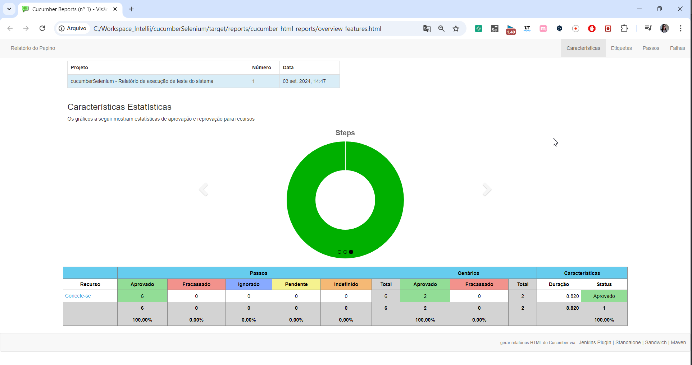

# Workshop - Mentoria 7

Este workshop de Cucumber foi ministrado por @Adam Vinícius fundador da [Chronos Academy](https://chronosacademy.orbitpages.online/)

Neste projeto realizamos a validação de login na lojinha.

# IDE
* [Intellij](https://www.jetbrains.com/idea/download/?section=windows)

# Dependências
* [Selênio Java » 4.24.0](https://mvnrepository.com/artifact/org.seleniumhq.selenium/selenium-java/4.24.0)
* [Cucumber JVM: Java » 7.18.1](https://mvnrepository.com/artifact/io.cucumber/cucumber-java/7.18.1)
* [Cucumber JVM: JUnit 4 » 7.18.1](https://mvnrepository.com/artifact/io.cucumber/cucumber-junit/7.18.1)

# Plugin
* [Cucumber for Java](https://plugins.jetbrains.com/plugin/7212-cucumber-for-java)
* [Gherking](https://plugins.jetbrains.com/plugin/9164-gherkin)

# Criar estrutura de pastas

* test
    * java
        * botão direito
            * new > package
                * runner: execução
                    * Botão direito > new > class: RunnerTest
                * core: controlar selenium e navegador
                    *  Botão direito > new > class: Driver
                * pages: pageObjects - controle de paginas
                    * Botão direito > new > class: LoginPage
                * steps: espaço para o Cucumber
                    * Botão direito > new > class: LoginSteps
                * maps: mapeamentos
                    * Botão direito > new > class: LoginMaps

* test
    * botão direito
        * new >
            * Directory: resources
                * feactures
                    * Botão direito > new > file: login.feature
                        * Configurar login.feacture com o plugin Gherkin
                            * login.feacture > Botão direito > Override File Type > Gherkin

# Visualizar Relatório Builder
* target
  * botão direito > Open In > Explorer
    * target\reports\cucumber-html-reports
      * overview-features.html

